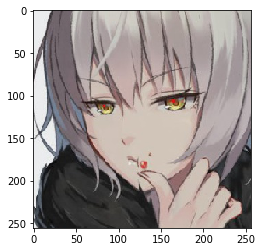

# Jeanne Recognizer

## Attention
train・test・predictデータは個人的に用意しました。  
数が少ない+ジャンヌ区別つきにくいので、精度低いです。  

train・test・predictは公開できません。  
Githubのデスクトップアプリで、コミットしているので、Kerasのモデルやweightデータはアップできません。(アップしません。)  

## Test

    この写真は、 Jeanne
    55 %の可能性で合っているだろう

    この写真は、 JeanneAlt
    49 %の可能性で合っているだろう

    この写真は、 JeanneAltLi
    40 %の可能性で合っているだろう

    この写真は、 JeanneAltLi
    38 %の可能性で合っているだろう

    この写真は、 Jeanne
    48 %の可能性で合っているだろう

    この写真は、 Jeanne
    48 %の可能性で合っているだろう

## Demoノート
[デモ：Check_jeanne](./md_check_jeanne/check_jeanne.md)  
