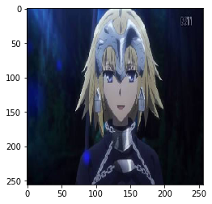
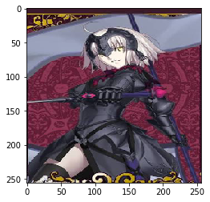
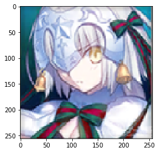
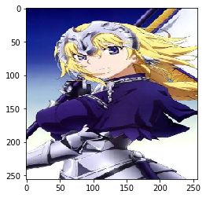
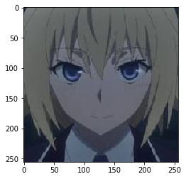
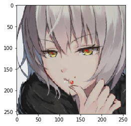

```python
import matplotlib.pyplot as plt
import numpy as np
from PIL import Image
from keras.models import load_model
```

    Using TensorFlow backend.


```python
LABELS = ["Jeanne", "JeanneAlt", "JeanneAltLi"]

#保存したモデル
model = load_model('./models/jeanne_model.hdf5')
```


```python
def check_jeanne(url):
    # 対象画像のインポート&
    img = Image.open(url)
    img = img.convert("RGB")
    img = img.resize((256, 256))
    plt.imshow(img)
    plt.show()
    x = np.asarray(img)
    x = x.reshape(-1, 256, 256, 3)
    x = x / 255

    # 予測
    pre = model.predict(x)
    #確率の一番高いインデックス番号を取得
    idx = np.argmax(pre, axis=1)[0]
    #一番高い確率をパーセンテージで取得
    per = int(pre[0][idx] * 100)
    
    return (idx, per, img)
```


```python
def check_jeanne_result(url):
    idx, per, img = check_jeanne(url)
    #答えを表示
    print("この写真は、", LABELS[idx])
    print(per, "%の可能性で合っているだろう")
```


```python
check_jeanne_result('./picture/IMG_0419.jpg')
```





    この写真は、 Jeanne
    55 %の可能性で合っているだろう


```python
check_jeanne_result('./picture/IMG_0467.JPG')
```





    この写真は、 JeanneAlt
    49 %の可能性で合っているだろう


```python
check_jeanne_result('./picture/IMG_6066.PNG')
```





    この写真は、 JeanneAltLi
    40 %の可能性で合っているだろう


```python
check_jeanne_result('./picture/IMG_6128.jpg')
```





    この写真は、 JeanneAltLi
    38 %の可能性で合っているだろう


```python
check_jeanne_result('./picture/out_face.jpg')
```





    この写真は、 Jeanne
    48 %の可能性で合っているだろう


```python
check_jeanne_result('./picture/out_face2.jpg')
```





    この写真は、 Jeanne
    48 %の可能性で合っているだろう


```python

```
